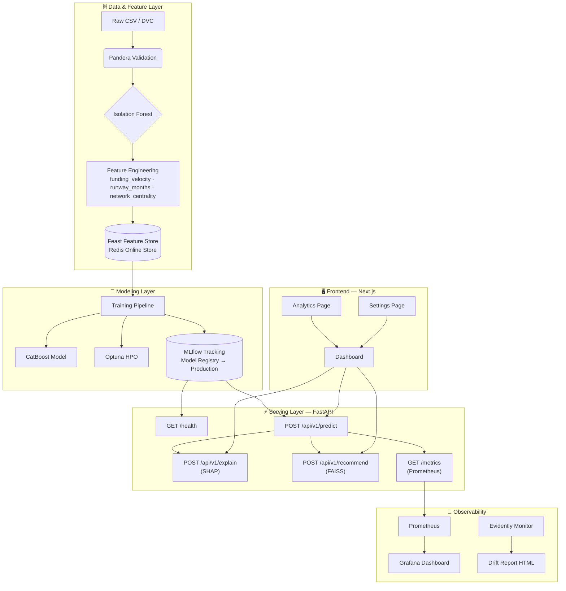

<div align="center">

<br />


# Startup Intelligence

**A production-grade Machine Learning system to predict startup success,<br/>explain every decision, and surface similar companies at lightning speed.**

<br/>

[](https://github.com/AadityaBhuree/startup-success-engine/actions/workflows/ci.yml)
[](https://www.python.org/)
[](https://fastapi.tiangolo.com/)
[](https://nextjs.org/)
[](https://mlflow.org/)
[](https://prometheus.io/)
[](LICENSE)

<br/>

[🚀 Quick Start](#-quick-start) &nbsp;•&nbsp; [🏗 Architecture](#-system-architecture) &nbsp;•&nbsp; [⚡ API Reference](#-api-reference) &nbsp;•&nbsp; [📁 Project Structure](#-project-structure) &nbsp;•&nbsp; [🧪 Testing](#-testing)

<br/>

</div>

---

## ✨ What It Does

> Submit a startup's key metrics and get back — in milliseconds — a **viability probability**, an explanation of *why* it scored that way, and a ranked list of **similar companies** to benchmark against.

| Capability | Technology | Detail |
|---|---|---|
| 🧠 **Success Prediction** | CatBoost + Optuna | Categorical-native gradient boosting with automated HPO |
| 📊 **Explainability** | SHAP TreeExplainer | Per-feature attribution values for every prediction |
| 🔍 **Similar Startups** | FAISS + Sentence Transformers | Semantic nearest-neighbour search over the startup universe |
| 🛡 **Data Quality** | Pandera + Isolation Forest | Schema validation and anomaly removal before training |
| 📈 **Experiment Tracking** | MLflow + Model Registry | Full run history, artifact storage, and Production stage promotion |
| 🌊 **Feature Serving** | Feast + Redis | Online feature store for sub-millisecond feature retrieval |
| 📡 **Observability** | Prometheus + Grafana | Live request metrics, latency histograms, and dashboards |
| 🔄 **Drift Detection** | Evidently AI | Covariate drift monitoring with automated HTML reports |

---

## 🏗 System Architecture



---

## ⚡ API Reference

All endpoints are served at `http://localhost:8000`.

### `GET /health`
Returns the live status of every loaded component. Use this for Docker health checks and uptime monitoring.

```json
{
  "status": "ok",
  "model_loaded": true,
  "faiss_loaded": true,
  "shap_loaded": true
}
```

### `POST /api/v1/predict`
Returns a success probability between `0.0` and `1.0` for the given startup.

**Request body:**
```json
{
  "industry": "SaaS",
  "country": "USA",
  "months_active": 24,
  "total_funding_usd": 5000000,
  "burn_rate_proxy": 100000,
  "co_investor_count": 3
}
```

**Response:**
```json
{ "success_probability": 0.847 }
```

### `POST /api/v1/explain`
Returns SHAP feature attribution values explaining the prediction.

```json
{
  "shap_values": {
    "total_funding_usd": 0.35,
    "months_active": 0.15,
    "co_investor_count": 0.10,
    "country": 0.02,
    "industry": -0.05,
    "burn_rate_proxy": -0.22
  }
}
```

### `POST /api/v1/recommend`
Returns top-5 similar startups ranked by semantic embedding similarity.

```json
{
  "similar_startups": [
    { "name": "Alpha SaaS Solutions", "similarity": 0.94 },
    { "name": "NextGen SaaS Co",      "similarity": 0.88 }
  ]
}
```

### `GET /metrics`
Standard Prometheus exposition format — scraped automatically by the Prometheus container.

---

## ⚡ Latency Budget

Target end-to-end latency for `/api/v1/predict`: **< 150 ms**

| Step | Component | Target |
|---|---|---|
| 🗄 Feature Retrieval | Feast / Redis | `10 – 20 ms` |
| 🧠 Inference | CatBoost | `5 – 15 ms` |
| 📊 Explainability | SHAP TreeExplainer | `30 – 50 ms` |
| 🌐 Network Overhead | FastAPI + transfer | `10 – 20 ms` |
| **Total** | | **`~55 – 105 ms`** |

FAISS recommendations are consistently **< 50 ms** for cached queries via Redis.

---

## 🚀 Quick Start

### Prerequisites
- Python 3.10+, [Poetry](https://python-poetry.org/docs/#installation)
- Node.js 18+ (for the frontend)
- Docker & Docker Compose (for the full infrastructure stack)

### 1 — Clone & Install

```bash
git clone https://github.com/AadityaBhuree/startup-success-engine.git
cd startup-success-engine

# Install Python dependencies
make install

# Install frontend dependencies
cd app/frontend && npm install && cd ../..
```

### 2 — Configure Environment

```bash
cp .env.example .env
# Edit .env with your secrets (Postgres password, MinIO key, etc.)
```

### 3 — Generate Data & Train

```bash
# Generate the mock startup dataset and track with DVC
python src/utils/generate_mock_data.py
dvc add data/raw/startups.csv

# Train the CatBoost model (logs to MLflow, promotes to Registry)
MLFLOW_TRACKING_URI=sqlite:///mlflow.db python src/train.py
```

### 4 — Start the Stack

**Option A — Full Docker Stack** (recommended for production-like testing):
```bash
make up
# Services: FastAPI · MLflow · Feast · Postgres · MinIO · Redis · Prometheus · Grafana
```

**Option B — Local Dev Mode**:
```bash
# Terminal 1 — Backend
MLFLOW_TRACKING_URI=sqlite:///mlflow.db poetry run uvicorn app.backend.main:app --host 0.0.0.0 --port 8000 --reload

# Terminal 2 — Frontend
cd app/frontend && npm run dev
```

Open **http://localhost:3000** for the dashboard · **http://localhost:8000/docs** for Swagger UI.

### 5 — Materialize Feature Store

```bash
make materialize
# Runs: feast apply && feast materialize-incremental <now>
```

---

## 🧪 Testing

```bash
# Run all tests with coverage
make test

# Or directly with pytest
PYTHONPATH=. MLFLOW_TRACKING_URI=fallback pytest tests/ -v --cov=app --cov=src
```

**Current test suite:**

| Module | Tests | Covers |
|---|---|---|
| `test_api.py` | 3 | `/predict`, `/explain`, `/recommend` endpoints |
| `test_inference.py` | 8 | Predict/explain/recommend fallback behaviour |
| `test_data_pipeline.py` | 8 | Schema validation, anomaly cleaning |
| **Total** | **19** | **All passing ✅** |

CI runs automatically on every push to `main` via GitHub Actions: format check (`black`), linting (`flake8`), tests with coverage report.

---

## 🔬 Engineered Features

Beyond the raw inputs, the pipeline computes three derived signals that improve model accuracy:

| Feature | Formula | Signal |
|---|---|---|
| `funding_velocity` | `total_funding_usd / months_active` | How aggressively capital is being raised |
| `runway_months` | `total_funding_usd / burn_rate_proxy` | Estimated months before the startup runs out of cash |
| `network_centrality` | `log1p(co_investor_count)` | Social proof from the investor network, log-scaled |

---

## 📊 Observability

### Prometheus Metrics
The FastAPI backend exposes `/metrics` with full Prometheus instrumentation:
- `http_requests_total` — request count by method, path, and status
- `http_request_duration_seconds` — latency histogram (P50, P95, P99)

### Grafana
Grafana is available at `http://localhost:3001` (default admin password in `.env`). Connect it to Prometheus at `http://prometheus:9090`.

### Drift Detection
Run the monthly drift report manually or via a cron job:
```bash
python src/monitor_drift.py
# Outputs: data/drift_report.html and data/drift_summary.json
```
If >50% of columns show statistical drift, the script raises an alert to retrain the model.

---

## 📁 Project Structure

```
startup-success-engine/
├── .github/
│   └── workflows/
│       └── ci.yml               # CI: black + flake8 + pytest + coverage
├── app/
│   ├── backend/
│   │   ├── main.py              # FastAPI app, middleware, routes
│   │   └── inference.py         # InferenceEngine (CatBoost + SHAP + FAISS)
│   └── frontend/
│       └── src/
│           ├── app/
│           │   ├── page.tsx     # Dashboard (predict + explain + recommend)
│           │   ├── analytics/   # Session prediction history & stats
│           │   └── settings/    # Threshold sliders & display prefs
│           └── components/
│               ├── Sidebar.tsx          # Navigation with active highlighting
│               ├── PredictionForm.tsx   # Input form with motion animations
│               ├── FeatureExplanation.tsx
│               └── SimilarStartups.tsx
├── docker/
│   ├── docker-compose.yml       # Full infrastructure stack (env-var driven)
│   ├── backend.Dockerfile
│   └── prometheus.yml           # Scrapes /metrics from FastAPI backend
├── feature_store/
│   ├── feature_store.yaml       # Feast project config (local + Redis)
│   └── features.py              # Entity, FileSource, FeatureView definitions
├── src/
│   ├── config.py                # Centralised config (env-driven)
│   ├── data_pipeline.py         # Pandera validation + Isolation Forest
│   ├── features.py              # Engineered features (velocity, runway, centrality)
│   ├── models.py                # CatBoost + Optuna + MLflow Registry
│   ├── train.py                 # End-to-end training pipeline
│   ├── engine.py                # Prediction + SHAP + FAISS search
│   ├── monitor_drift.py         # Evidently drift report
│   └── benchmark_embeddings.py  # FAISS index benchmarking
├── tests/
│   ├── test_api.py              # API endpoint integration tests
│   ├── test_inference.py        # InferenceEngine unit tests
│   └── test_data_pipeline.py    # Data pipeline unit tests
├── data/
│   └── raw/startups.csv         # DVC-tracked mock dataset
├── .env.example                 # Environment variable template
├── .flake8                      # Linting configuration
├── Makefile                     # install · up · down · test · lint · materialize
└── pyproject.toml               # Poetry dependencies
```

---

## 🛠 Make Targets

| Command | What it does |
|---|---|
| `make install` | Install all Python deps via Poetry |
| `make up` | Start full Docker stack in detached mode |
| `make down` | Stop and remove all Docker containers |
| `make test` | Run pytest with coverage |
| `make lint` | Run black + flake8 |
| `make materialize` | Apply Feast registry and materialize features to Redis |

---

## 🗺 Roadmap

- [ ] Real-time feature serving from Feast Redis online store in the inference path
- [ ] Grafana dashboard templates auto-provisioned on `make up`
- [ ] GitHub Actions cron job for monthly Evidently drift report
- [ ] Investor network graph via NetworkX for richer `network_centrality`
- [ ] Docker image publishing via GitHub Actions CD pipeline

---

<div align="center">

Built with 🩵 by **Aditya Bhure** &nbsp;·&nbsp; Powered by CatBoost · SHAP · FAISS · FastAPI · Next.js · MLflow

</div>
