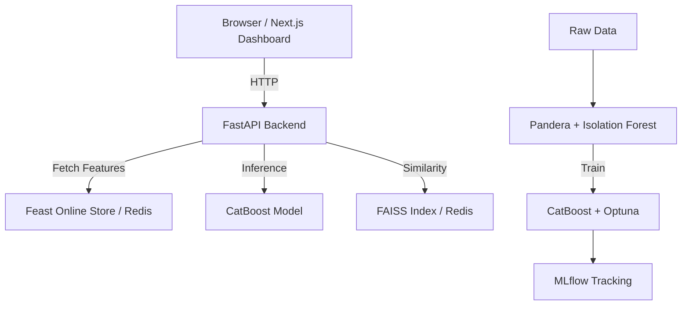

# Codebase Memory: Startup-Intelligence

## PHASE 1 — REPOSITORY DISCOVERY

**Root Structure:**
- `.github/workflows/`: CI/CD pipelines (planned)
- `app/backend/`: FastAPI application routers and dependencies
- `app/frontend/`: Next.js / Tailwind UI dashboard (planned)
- `docker/`: Dockerfiles and `docker-compose.yml` for infrastructure orchestration
- `feature_store/`: Feast repository for offline/online feature storage
- `src/`: Core ML and data engineering pipelines (`data_pipeline.py`, `features.py`, `models.py`, `engine.py`, `benchmark_embeddings.py`)
- `tests/`: Pytest test suite (planned)
- `data/raw/`: DVC-tracked raw datasets
- `Makefile`: Task runner (install, up, down, test, lint)
- `pyproject.toml`: Poetry dependency management
- `README.md`: Project overview and architecture

## PHASE 2 — TECHNOLOGY DETECTION

- **Frontend Framework:** Next.js
- **Backend Framework:** FastAPI
- **Database:** PostgreSQL (for Feast metadata), Redis (for Feast online store and FAISS caching), MinIO (S3 object storage for MLflow artifacts)
- **Authentication:** Custom / TBD
- **State Management:** TBD (Frontend), Redis (Backend Caching)
- **Styling:** Tailwind CSS
- **Infrastructure:** Docker Compose (local orchestration), DVC (Data Version Control)
- **Machine Learning:** CatBoost, Optuna, MLflow, FAISS, Sentence-Transformers, Pandera, Scikit-Learn

## PHASE 3 — PROJECT PURPOSE ANALYSIS

1. **Business Problem:** Predicting startup success probabilities (IPO/Acquisition vs Failure) to aid investors in decision-making, while explaining *why* via SHAP values, and recommending similar startups.
2. **Users:** Investors, Venture Capitalists, and Market Analysts.
3. **Major Features:** Success prediction, Prediction Explainability (SHAP), Similar Startup Recommendations (FAISS).
4. **User Workflow:** User inputs startup details -> Backend processes features via Feast -> CatBoost predicts success -> SHAP explains the score -> FAISS retrieves similar startups -> Dashboard displays results.
5. **Primary Entities:** Startups, Features (Funding velocity, burn rate, network centrality).

## PHASE 4 — ARCHITECTURE ANALYSIS

## PHASE 5 — ROUTING INTELLIGENCE

**Backend Routes (FastAPI):**
| Route | Method | Purpose | Auth Required |
| --- | --- | --- | --- |
| `/api/v1/predict` | POST | Predict startup success probability | No |
| `/api/v1/explain` | POST | Generate SHAP values for prediction | No |
| `/api/v1/recommend` | POST | Retrieve similar startups via FAISS | No |

*(Frontend Next.js routes are currently in planning).*

## PHASE 6 — FRONTEND ANALYSIS

*Note: The frontend is currently in the scaffolding phase (Next.js + Tailwind). It will handle displaying prediction results, SHAP charts, and recommendation cards.*

## PHASE 7 — BACKEND ANALYSIS

**Controllers/Routes:**
Located in `app/backend/main.py`. Currently mocked endpoints.

**Business Logic (`src/`):**
- `data_pipeline.py`: Loads CSV, validates via Pandera, removes anomalies via Isolation Forest.
- `models.py`: Model training stubs for Baseline and CatBoost models.
- `engine.py`: Inference logic (CatBoost, SHAP, FAISS).
- `benchmark_embeddings.py`: Evaluates embedding models using Silhouette Score.

## PHASE 8 — DATABASE INTELLIGENCE

- **PostgreSQL:** Acts as the offline feature registry for Feast.
- **Redis:** Acts as the online feature store for low-latency serving and FAISS embedding cache.
- **MinIO (S3):** Artifact store for MLflow tracking.

## PHASE 9 — DATA FLOW ANALYSIS

**Prediction Flow:**
User Action (Click Predict) ↓ Frontend (Next.js) ↓ API (`/api/v1/predict`) ↓ Business Logic (Fetch Feast features, run CatBoost inference) ↓ Response (Success Probability) ↓ UI Update.

## PHASE 10 — DEPENDENCY GRAPH

- **Poetry:** Manages Python dependencies (FastAPI, CatBoost, Feast, MLflow, etc.).
- **Make:** Orchestrates Docker and Poetry commands.
- **Docker Compose:** Wires the 8 microservices together.
